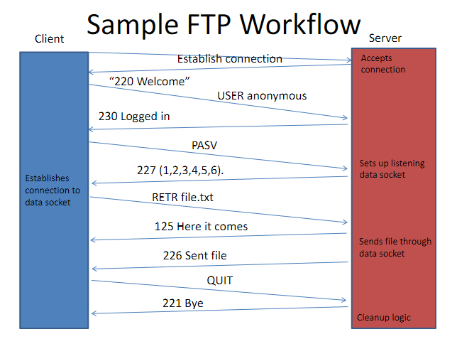

# Tutorial 10, C Server Programming

- Today, we're going to get you ready for assignment 3
- In addition, I'm going to share my perspective on how to be successful, both in terms of C programming and with respect to the assignment itself
- We won't be able to cover everything today, but I highly recommend carving out time this weekend to go through some resources I'll share

# Background

- Assignment 3 asks you to implement an FTP server
  - Your server takes commands from a client, and returns files (or information about files)
  - Active: server establishes the 'channel' for sending data (...client establishes command channel)
  - Passive: client establishes the 'channel for sending data (...alongside command channel!)
- Gain familiarity with writing network programs in C
  - This is... hard
  - Like with Java, follow examples; copy-paste is a programmer's best friend (mostly)

# RFC 959

- The RFC you're interested in for this assignment is [959](https://www.ietf.org/rfc/rfc959.txt9); I would look to ask clarifying questions early on
  - USER, QUIT,
  - CWD, CDUP (`cd ..`), NLST (list directory)
  - TYPE (image, ASCII), MODE, STRU, PASV (active vs. passive)
  - RETR... retrieve the file
- (It's an easier read than the other RFCs, IMO, but feel free to reference other material online)

# Application Protocols

- Establish a connection
- Server loops and waits for input; multiple threads support multiple connections
- Messages change server state accordingly; some messages elicit response (e.g., file data)

# Example FTP Workflow

# FTP Command Syntax

- `<command> <arg1> <arg2> ... <argN>`
- Space delimited
- Will need syntactic check ("is the input valid?") and semantic check ("do the arguments make sense?")

# Implementation

- (Copied from Canvas; I agree with what's given)

1. Open a socket and accept a client connection; dump the received text to the console; test with `nc`
2. Have the server send a response (`nc` can also be used here)
3. Open a thread for the connection; handle closing the thread and connection with `quit`
   1. You'll have a main `run` loop that iterates until this command is hit
4. Work on string parsing of commands (...this tutorial's main focus)
5. Implement each command: save PASV, NLST (see `dir.c`), and RETR for last

# Tips

- Work incrementally
- Pair program
- Handle `\r\n` at the end of your strings (...there is to "strip" strings, but mostly straightforward to implement)
- Creating additional files is potentially helpful, but don't do so until the end (as a refactoring task)
  - (If you don't get there, don't sweat it)
- Format your code; many editors can do this natively; I like `.editorconfig` files to help with this

# Agenda

- We're going to cover some C programming
  - Refresher, a debugging tip, `pthread`s, and strings
- Time permitting, we'll look at [Beej's Guide to Network Programming](https://beej.us/guide/bgnet/html/split)
- **Please go through this guide after tutorial as well**
  - Chapters 2-3 give important background to network programming in C
  - Chapter 5 explains key functions you'll have to use
  - Chapter 6 gives an example client and server

# That's all folks!

- Thanks for coming out; should you have any questions or concerns reach out at mdemar01 \[at\] student \[dot\] ubc \[dot\] ca
